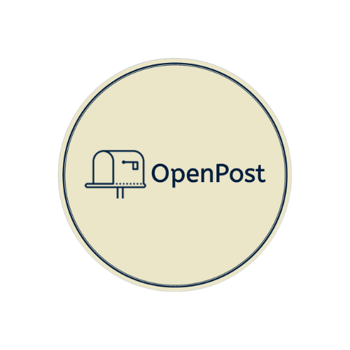
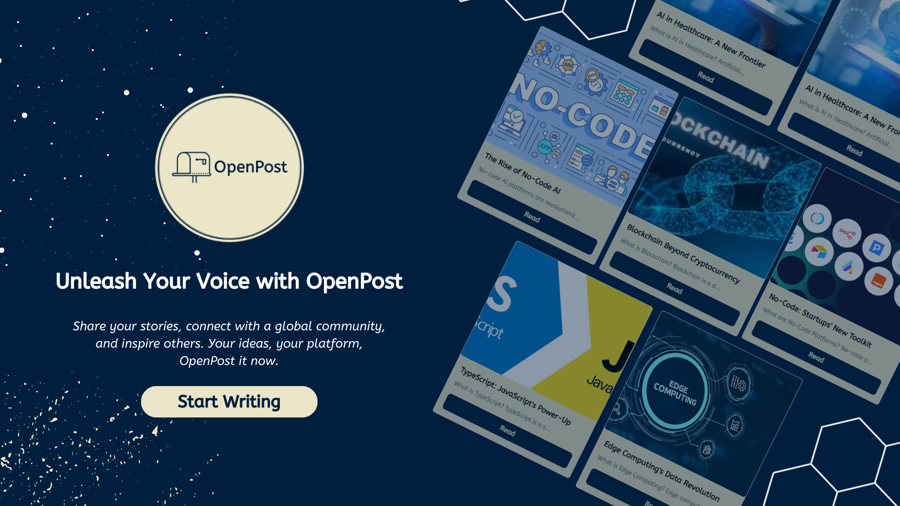

# OpenPost

OpenPost is a free and open-source blogging platform that allows you to create and share your content with the world. It is built on top of the popular open-source project, Appwrite.



## Demo

[Demo](https://open-post.vercel.app/)

## Features

-   Responsive Design
-   Advance Text Editor
-   Authentication
-   CRUD Operations

## Tech Stack

**Client:** React, Redux, TailwindCSS

**Server:** Appwrite

## Run Locally

Clone the project

```bash
  git clone https://github.com/Muntahi-Safwan/OpenPost
```

Go to the project directory

```bash
  cd OpenPost
```

Install dependencies

```bash
  npm install
```

Start the server

```bash
  npm run dev
```

## Environment Variables

To run this project, you will need to add the following environment variables to your .env file

`APPWRITE_URL`

`APPWRITE_PROJECT_ID`

`APPWRITE_DATABASE_ID`

`APPWRITE_COLLECTION_ID`

`APPWRITE_BUCKET_ID`

`TinyMCE_API_KEY`

## FAQ

#### What is OpenPost?

OpenPost is a free and open-source blogging platform that allows you to create and share your content with the world. It is built on top of the popular open-source project, Appwrite.

#### Is it free?

Yes, OpenPost is completely free to use. You can use it for personal or commercial purposes. There is no cost to use OpenPost.

#### How do I get started?

To get started with OpenPost, you need to create an account on the platform. Once you have an account, you can create a new blog post or edit an existing one.

## Contributing

Contributions are always welcome!

Please adhere to this project's `code of conduct`.

## Authors

-   [@Muntahi-Safwan](https://www.github.com/Muntahi-Safwan)

## License

[MIT](https://choosealicense.com/licenses/mit/)
